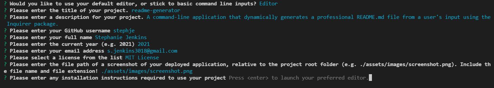

# readme-generator

## Description

A command-line application that dynamically generates a professional README.md file based on user input. Utilises the Inquirer package.

## Table of Contents

-   [Installation](#installation)
-   [Usage](#usage)
-   [License](#license)
-   [Credits](#credits)
-   [Contributing](#contributing)
-   [Tests](#tests)
-   [Questions](#questions)

## Installation

Run 'npm i' from the command line to install required packages.

## Usage

Run 'node index.js' to initialize and answer prompts. Output is saved to a file called 'Generated_README.md' in the root folder.

#### TEXT EDITORS: 
This README generator provides the option to use a text editor rather than basic command line inputs for sections of the README that are likely to require multi-line input.

If the option to use a text editor is selected, a temporary file will be created in the user's selected editor. This file is read in when the user exits the editor.

If no specific editor has been set, then notepad (on Windows) or VIM (Linux or Mac) will be used. See https://www.npmjs.com/package/inquirer for more information.

If you are running this program in an environment such as a Docker container or similar, please ensure that you have installed VIM in that environment (i.e. run 'apt-get install vim' for ubuntu-based containers, etc).

#### SCREENSHOTS: 
If no path for an application screenshot is specified at the relevant prompt, the default file location is ./assets/images/screenshot.png
This can be manually edited or removed in the Generated_README.md file later if need be. 

## License

N/A

## Credits

[Markdown License Badges by lukas-h on GitHub](https://gist.github.com/lukas-h/2a5d00690736b4c3a7ba) was used to generate the badges for this project.

## Contributing

To contribute to this project, please reach out to the creator via email (contact details below).

## Tests

N/A

## Questions

For any questions pertaining to this project, the developer can be reached via any of the contact methods listed below.
Please ensure that you include the name of this project ("readme-generator") in any communications.

-   [GitHub](https://github.com/stephje)
-   [Email](mailto:s.jenkins3018@gmail.com)

## Screenshot of Deployed Application

